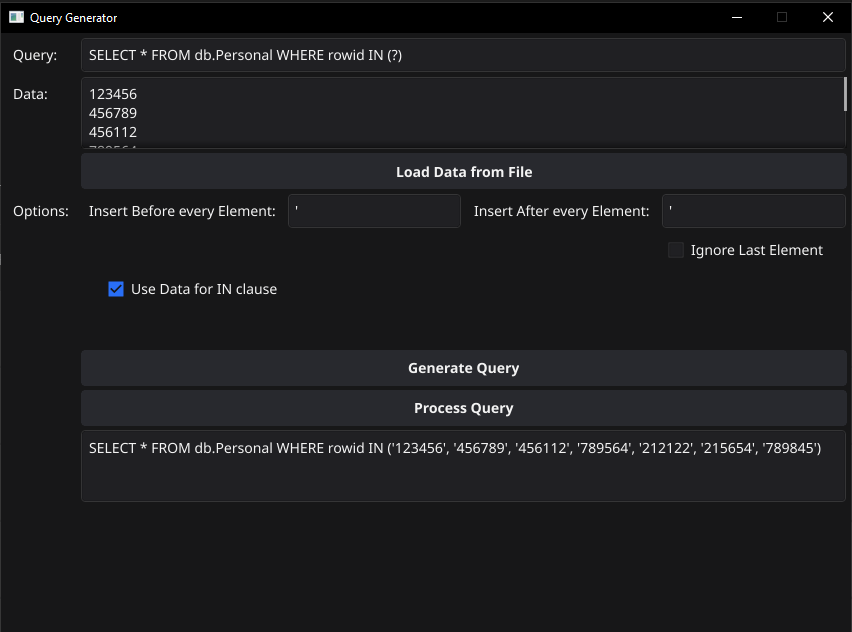

### Description
This application is used to create queries based on data input

### Dependencies
- the fyne framework



### Use Cases
- You have a list of id's and want to create a query with an IN clause
- You want to insert a bunch of data into a table

### Compile

```
fyne package -os windows
fyne package -os linux
fyne package -os macos
```